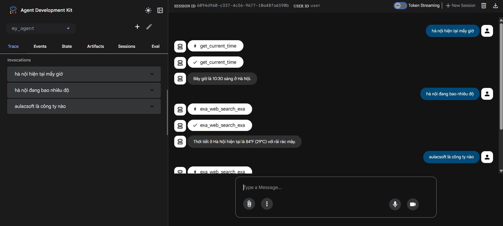

## Simple demo sử Google ADK + Exa MCP Intergration

Đây là demo nhỏ dùng **Agent Development Kit (ADK) cho Python** và **EXA MCP** để xây dựng một agent đơn giản dựa trên hướng dẫn từ tài liệu ADK Python Quickstart (`https://google.github.io/adk-docs/get-started/python/`).



### 1. Yêu cầu hệ thống

- **Python**: 3.10 trở lên  
- **pip**: đã cài sẵn  
- Khuyến nghị: dùng **virtual environment** (`.venv`)

### 2. Cài đặt môi trường

Từ thư mục gốc dự án:

```powershell
# Tạo và kích hoạt virtual environment (Windows PowerShell)
python -m venv .venv
.venv\Scripts\Activate.ps1

# Cài ADK + MCP client
pip install google-adk python-dotenv mcp
```

### 3. Cấu hình API key

Project sử dụng **Gemini API** nên cần API key:

1. Tạo API key trong Google AI Studio (trang API Keys).  
2. Tạo file `.env` trong thư mục gốc dự án với nội dung:

```env
GOOGLE_API_KEY = YOUR_API_KEY_HERE
EXA_API_KEY = YOUR_EXA_KEY
GOOGLE_CLOUD_LOCATION = YOUR_CLOUD_LOCATION
EXA_API_KEY = YOUR_EXA_API_KEY
OPENWEATHER_API_KEY = YOUR_OPENWEATHER_API_KEY
```

### 4. Cấu trúc dự án

```text
my_agent/
  agent.py       # code chính của agent (root_agent + MCP toolset)
  __init__.py    # đánh dấu package Python
  .env           # chứa GOOGLE_API_KEY, EXA_API_KEY (không commit lên GitHub)
```

Trong `agent.py`, agent sử dụng `google.adk.agents.llm_agent.Agent`, tool mẫu `get_current_time` và **MCP toolset** (nếu có `EXA_API_KEY`).

### 5. Chạy agent bằng CLI

Từ thư mục **cha** chứa `my_agent/`:

```powershell
# Đảm bảo lệnh `adk` có trong PATH
$env:Path += ";$env:USERPROFILE\AppData\Roaming\Python\Python313\Scripts"

# Chạy agent ở chế độ CLI
adk run my_agent
```

### 6. Chạy agent bằng Web UI (ADK Web)

Từ thư mục **cha** chứa `my_agent/`:

```powershell
adk web --port 8000
```

Sau đó mở trình duyệt và truy cập:

- `http://localhost:8000`

Chọn agent `my_agent` ở góc trên bên trái và chat với agent.

> Lưu ý: ADK Web chỉ dùng cho phát triển và debug, **không dùng cho production** (theo khuyến cáo trong tài liệu ADK).

### 7. MCP integration (Model Context Protocol)

1. Cài đặt Node.js để sử dụng `ntig`.
2. Thêm `EXA_API_KEY` (hoặc biến phù hợp với MCP server bạn dùng) vào `.env`.
3. Khi agent khởi tạo, ADK sẽ dùng `npx -y exa-mcp-server` (hoặc lệnh bạn tùy chỉnh trong `agent.py`) để kết nối MCP server thông qua `McpToolset`.
4. Nếu chưa đặt `EXA_API_KEY`, agent vẫn chạy, nhưng MCP toolset sẽ bị bỏ qua và có cảnh báo nhẹ.


``Exa MCP intergration docs : `` [Google ADK – MCP guide](https://docs.exa.ai/integrations/google-adk#exa-mcp-integration)

### 8. Cơ chế chọn và sử dụng tool trong agent này (Quan trọng)

Agent trong project này được thiết kế sử dụng **hai nguồn tool khác nhau** tùy theo loại câu hỏi:

| Loại câu hỏi                  | Tool được sử dụng                  | Lý do                                                                 |
|-------------------------------|------------------------------------|-----------------------------------------------------------------------|
| Câu hỏi về **thời gian, ngày giờ hiện tại** (ví dụ: “Bây giờ là mấy giờ?”, “Hôm nay thứ mấy?”) | **Mock tool** `get_current_time` (được định nghĩa trực tiếp trong `agent.py`) | Đảm bảo trả lời nhanh, chính xác 100% và không phụ thuộc vào mạng/MCP server. |
| Tất cả các câu hỏi còn lại (tìm kiếm thông tin, tra cứu web, v.v.) | **Exa MCP toolset** (qua `McpToolset` kết nối với Exa MCP server) | Tận dụng khả năng tìm kiếm thời gian thực,  các tool mạnh mẽ của Exa. |
 Câu hỏi thông tin về thời tiết | **get_current_weather** (Dùng API của `OpenWeather`) | 


